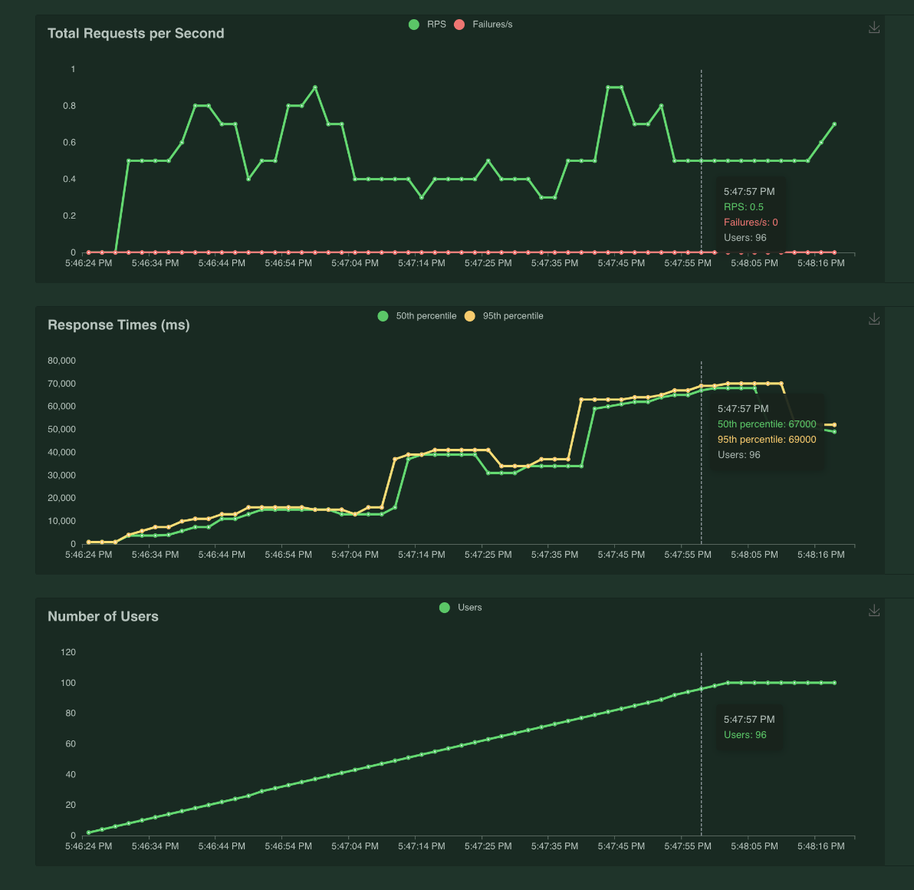

# Serving ML Model with FastAPI

### This repo will demostrate how to : 
- Serve ML model using FastAPI
- Isolate environment for ML application using Conda
- Containarize ML application using Docker/ docker-compose
- Conduct performance test using Locust

## Models
- Tensorflow MobileNet_V2 (Pretrained)
- Pytorch AlexNet (Pretrained)

## Pre-requisites
* Python (3.6+)

## Folder structure
```bash
fastAPI_object_classifier
├── env
│   ├── Dockerfile
│   ├── docker-compose.yml
│   ├── environment.yml
│   └── requirements.txt
├── src
│   ├── app
│   │   └── app.py
│   ├── pred
│   │   ├── models
│   │   │   ├── tf_pred.py
│   │   │   └── torch_pred.py
│   │   └── image_classifier.py
│   ├── schemas
│   │   └── image_schema.py
│   ├── utils
│   │   ├── test_images.py
│   │   └── utilities.py
│   └── main.py
└── tests
    ├── performance_test.py
    ├── unit_test.py
    └── helpers.py

```

## Running the Code
* Server should be running at `http://127.0.0.1:8000/docs`
#### With Conda
```bash
conda env create -f env/environment.yml
conda activate FastAPI_classifier
python3 src/main.py
```
#### With Docker
```bash
docker build -f env/Dockerfile -t fastapiimage .
docker run --name fastapicontainer -p 8000:8000 fastapiimage
```
#### With Docker-compose
```bash
docker-compose -f env/docker-compose.yml up --build
```
- To stop Docker-compose (inside the project directory)
```bash
docker-compose down
```

## Testing Result
#### In terminal
```
curl -X 'POST' \
  'http://127.0.0.1:8000/predict/torch_model/' \
  -H 'accept: application/json' \
  -H 'Content-Type: application/json' \
  -d '{"img_url": "<image_url>"}'
```
#### In webpage 
`http://127.0.0.1:8000/docs`
- Insert image url to `string`, then hit `Excecute`

  

## Performance Test for the End-point(s)
#### Running Unit Tests
```bash
pytest
```

#### Running the performance Tests using Locust
```bash
locust -f tests/performance_test.py
```
* Testing monitor UI can be accessed at `http://127.0.0.1:8089/`

* Set the host to be the FastAPI server URL (in this case `http://127.0.0.1:8000`)
