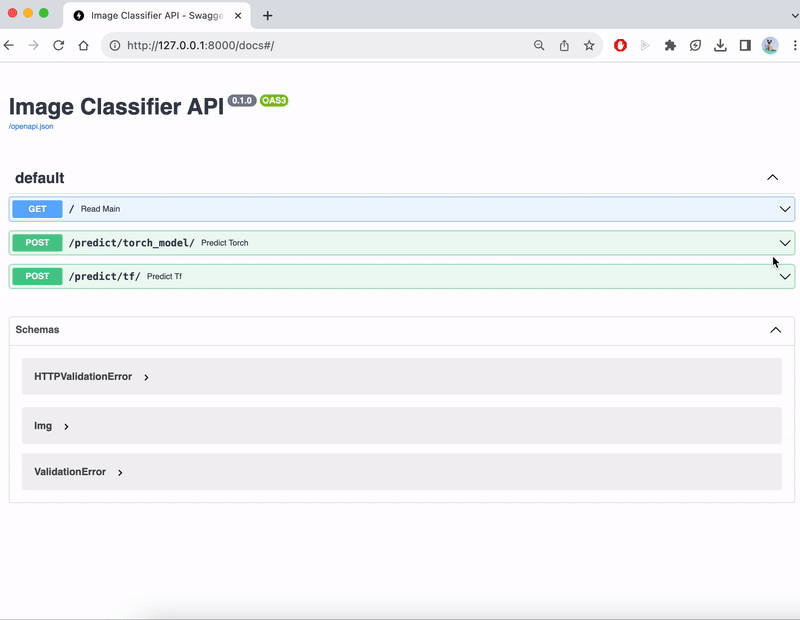
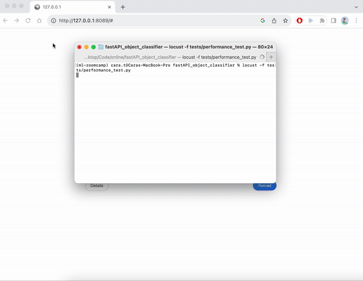

# Deploy ML Model to AWS lambda using Docker and FastAPI

### Model Deployment
- Serve ML model using FastAPI
- Containerize ML application using Docker/ docker-compose
- Deploy ML application to AWS lambda using Docker
- Conduct performance test using Locust

## DEMO
| Inference UI | Testing image |
|---|---|
|  |  |

##### Performance test with Lucust<br />



## Quick Start (run locally)
#### With Conda
```bash
conda env create -f env/environment.yml
conda activate FastAPI_classifier
python3 src/main.py
```
#### With Docker
```bash
docker build -f env/Dockerfile -t fastapiimage .
docker run --name fastapicontainer -p 8000:8000 fastapiimage
```
#### With Docker-compose
```bash
docker-compose -f env/docker-compose.yml up --build
```
- To stop Docker-compose (inside the project directory)
```bash
docker-compose -f env/docker-compose.yml down
```

## Deployment to AWS Lambda
- Publish image to ECR
```
aws ecr create-repository --repository-name {repo_name}
aws ecr get-login-password --region {region} | docker login\
    --username AWS \
    --password-stdin {aws_account_id}.dkr.ecr.{region}.amazonaws.com
docker tag {docker image} {repositoryUri}:{Tag}
docker push {repositoryUri}:{Tag}
```
- Create a lambda function using the ECR image
  - Change configuration (needed for model initialization)
    - timeout -> 30s
    - memory -> 1024MB
- Create Lambda URL and Test the FastAPI app
  - Configuration > Function URL > Create function URL > Auth type: NONE > Additional settings:CORS enabled > Save

## Inference 
#### In Terminal
```
curl -X 'POST' \
  'http://127.0.0.1:8000/predict/torch_model/' \
  -H 'accept: application/json' \
  -H 'Content-Type: application/json' \
  -d '{"img_url": "<image_url>"}'
```
#### In webpage 
Inference UI can be accessed at `http://127.0.0.1:8000/docs` if running locally


## Performance Test for the End-point(s)
#### Running Unit Tests
```bash
pytest
```

#### Running the performance Tests using Locust
```bash
locust -f tests/performance_test.py
```
* Testing monitor UI can be accessed at `http://127.0.0.1:8089/`
* If running locally, set the host to `http://127.0.0.1:8000` to test


## Models Used
- Pretrained MobileNet_V2 (Tensorflow)
- Pretrained AlexNet (Pytorch)
